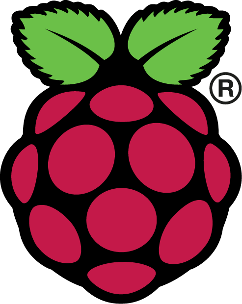

{: width="175" height="220" style="display:block; margin-left:auto; margin-right:auto"}

## ΕΛΛΗΝΙΚΗ ΜΕΤΑΦΡΑΣΤΙΚΗ ΟΜΑΔΑ RASPBERRY PI

Γίνετε εθελοντής ως μεταφραστής για να μας βοηθήσετε να κάνουμε διαθέσιμα σε όλο τον κόσμο, όλα τα δωρεάν εργαλεία συγγραφής κώδικα!

## ΓΙΑΤΙ ΝΑ ΜΕΤΑΦΡΑΣΕΤΕ;

Θα υποστηρίξετε την αποστολή του Ιδρύματος Raspberry Pi: να δώσουμε τη δύναμη της ψηφιακής δημιουργίας στα χέρια ανθρώπων σε όλο τον κόσμο. Θέλουμε να βοηθήσουμε τους ανθρώπους να μάθουν να συγγράφουν κώδικα, γι' αυτό πρέπει να προσφέρουμε τα δωρεάν εργαλεία μας σε όσο το δυνατόν περισσότερες γλώσσες, ώστε ο καθένας να μπορεί να τα χρησιμοποιήσει!

Για να δείτε τη σπουδαία δουλειά που κάνουν οι εθελοντές μεταφραστές, μεταβείτε στη [σελίδα των έργων](https://projects.raspberrypi.org/en/) και κάντε κλικ στο μενού γλώσσας επάνω δεξιά.

## Η ΣΥΜΜΕΤΟΧΗ ΕΙΝΑΙ ΑΠΛΗ

Ο εθελοντισμός είναι απόλυτα ευέλικτος και δεν χρειάζεστε προηγούμενη εμπειρία με μετάφραση ή προγραμματισμό! Το μόνο που χρειάζεσαι είναι:

* Άριστη γνώση Αγγλικών και Ελληνικών  
* Λίγες ώρες ελεύθερες  
* Ενδιαφέρον να μάθετε κάτι νέο  

Μπορείτε να μεταφράσετε οπουδήποτε έχετε σύνδεση στο Διαδίκτυο.

## ΤΙ ΘΑ ΚΕΡΔΙΣΕΤΕ ΑΠΟ ΤΗ ΣΥΜΜΕΤΟΧΗ ΣΑΣ

* Παίρνετε όλα τα εργαλεία και την υποστήριξη που χρειάζεστε από το Ίδρυμα Raspberry Pi  
* Μπορείτε να αποφασίσετε πόσο χρόνο θα αφιερώσετε  
* Μπορείτε να γνωρίσετε εκατοντάδες εθελοντές μεταφραστές μας στο διαδίκτυο  
* Μπορείτε να χρησιμοποιήσετε τις γλωσσικές σας γνώσεις για να κάνετε κάτι καλό, να μάθετε νέα πράγματα και να διασκεδάσετε  

[ΠΩΣ ΕΓΓΡΑΦΟΜΑΙ;](http://rpf.io/translate)

Όταν εγγραφείτε για να γίνετε μέλος της καταπληκτικής μας μεταφραστικής κοινότητας, η υπεύθυνη μετάφρασης **Nina** θα έρθει σε επαφή μαζί σας εντός μιας εβδομάδας για να σας βοηθήσει να ξεκινήσετε.

[ΠΗΓΗ](https://www.raspberrypi.org/translate/)

Μπορείτε να δείτε και οδηγίες μετάφρασης στο βίντεο της Ελληνικής Ομάδας μεταφράσεων:  
<iframe width="560" height="315" src="https://www.youtube.com/embed/6hNkU4KtM5s" title="YouTube video player" frameborder="0" allow="accelerometer; autoplay; clipboard-write; encrypted-media; gyroscope; picture-in-picture" allowfullscreen></iframe>

Περισσότερο υλικό για μελέτη:  
* [Πως να ξεκινήσεις](https://raspberrypitranslation.atlassian.net/jira/dashboards/10000)  
* [Στρατηγικές μετάφρασης](https://raspberrypitranslation.atlassian.net/jira/dashboards/10142)
